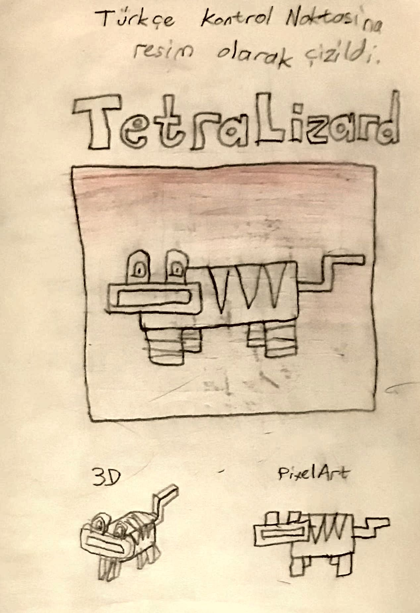
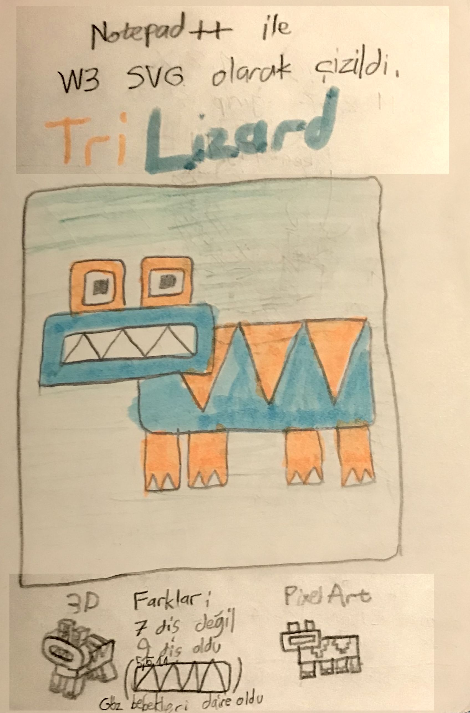
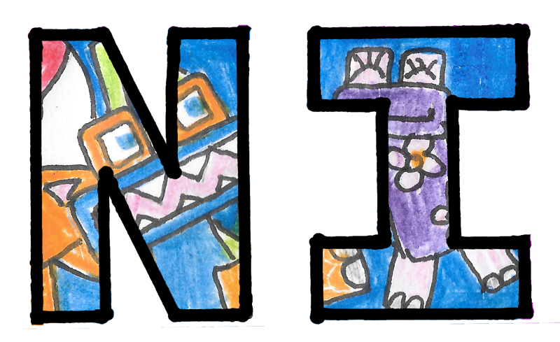
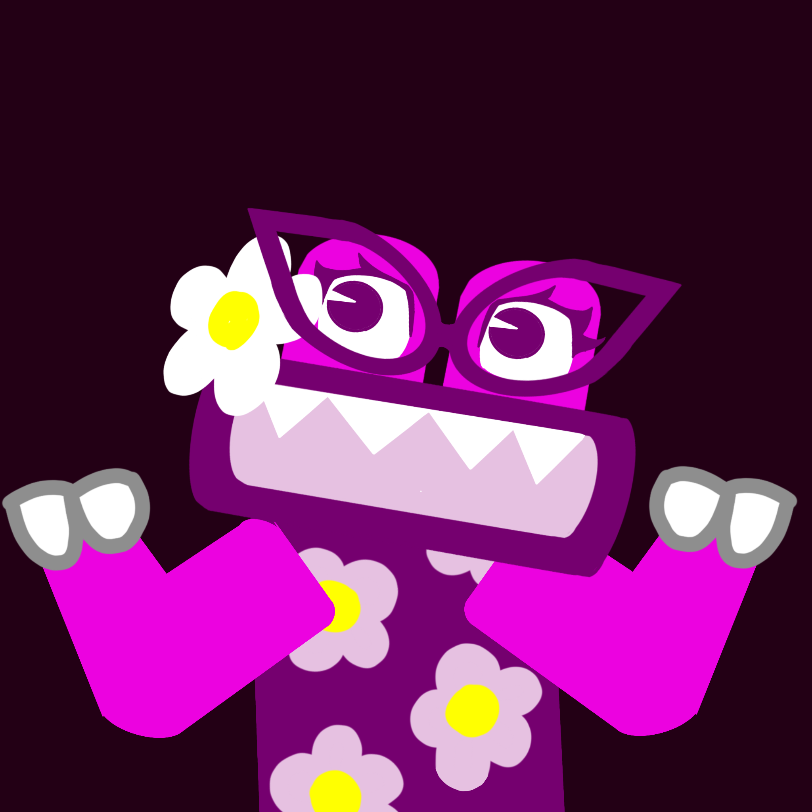
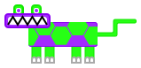

TriLizard is a cute lizard-frog figure that I pretty much use as my personal mascot. It has much personal meaning to me, almost as
if it is one of my relatives. Given this, I really had to write about it on my almost-new blog.

## What is TriLizard

TriLizard, since the 2015-2016 school year, is a lizard or frog looking creature usually drawn in a very stylised manner. It can be
described as follows: a rounded rectangular blue torso with three triangle shaped stripes on the back, a 4:1 rectangular head to
the corner of the torso with orange rectangular protrusions for the blue eyes without any pupil, a rectangular mouth showing the
interlocking white sawtooth teeth, four rectangular legs below the torso with pairs side by side and each feet ending with two white
toenails, and an orange winding arm shaped tail. The tail and stripes may not be depicted depending on the viewing angle.
 
## How it has Started

In Turkey, you take an exam to get placed in a high school. Back in my time the exam was TEOG (Temel Eğitimden Ortaöğretime Geçiş Sınavı).
Now I am writing this next to my brother who is studying for the LGS (Liseye Geçiş Sınavı), the current version of the exam. No
matter the name and format, the exam is very competitive since it is used to match three million students to high schools, and this
naturally brings a lot of stress for the student.

My way of coping the stress was to draw usually. I would draw a lot. If I was too occupied by the school work itself, I'd doodle,
and TriLizard was born out of one of those doodles. During one of the Turkish Language classes, we had to solve an exercise about
"eylemsiler" (infinitive verbs, participles etc.) The exercise consisted of a table-formatted page. On the empty top-left cell, I
have doodled the first ever TriLizard, which I have called TetraLizard afterwards given the amount of tetragones comparable to the
number of triangles in the current version. Although I have lost the original book with the doodle, I am keeping a near-exact hand
drawn copy very carefully. You can see it below.

The header translates from Turkish into "It is drawn as a picture into the Turkish Checkpoint (the title of the workbook)."

The next step was to give it some color. I had drawn one TriLizard very similar to the doodle from memory the same day. To color it
I had red, blue, and black pencils, and blue and orange highlighters. I chose to color the wide regions in blue and orange, and
gave some accent using the pencils. The modern color palette of TriLizard was born. On these pages you can also find accompanying
3D and pixel art designs. I have only made a digital pixel art of the head, and with a higher pixel resolution than the original.

The header translates into from Turkish "It is drawn as a W3 SVG using Notepad++." In the lower part of the page it reads "The difference are that there are now not seven teeth but 9 instead, and the pupils have become circles." I had also taken note of "5,5 11" which are the y positions of the zigzag that separates the upper and lower teeth.

You can find and download the SVG below. If you open it in a text editor, you will see my original signature, linking to my Scratch account.

## Possible Inspirations

Humans are never completely creative, and TriLizard might also have its ancestor designs. Some possibilities are:

 - Wilt from *Foster's Home for Imaginary Friends* (highly likely, I really liked this cartoon a few years before creating TriLizard)
 - Wubbox from *My Singing Monsters* (not so likely but unnervingly similar in some aspects)

## MyLizard Species

I love developing video games and I have always thought of putting TriLizard or the design as one of the central elements of one of
my games. If I had my own website (which I kinda do now) I could even have a system where the users would make their own MyLizard
avatars for use in social circles within the website. To test out the idea, there are some alternative designs of TriLizard which
would be able to be made in such a customizer.

- TetraLizard: Striped socks on feet, rounded eye protrusions, narrower stripes.
- FloralLizard: Purple and pink coloring, flower pattern on torso.

- HexaLizard: Line and purple colouring, hexagonal pattern on torso.

How to Use TriLizard

TriLizard is a very basic design, therefore comparable designs can be found everywhere; however, if you are heavily inspired by my work coming up with a similar character, I would really like some credit and please, a link to this website. Also, you can use TriLizard in order to refer to me and my work, but please be respectful doing so and don't taint my name with it.

All the media on this page are available under a [Creative Commons Attribution-ShareAlike 4.0 International License](https://creativecommons.org/licenses/by-sa/4.0/), reflecting my above statement.

