Hello. I am Mert Bora İnevi, the main author of this blog and the creator and owner of this website.

I am a developer and artist from İstanbul, Turkey, who likes doing nice things on his computer, and also with a touch of creativity! My will to be productive is what has allowed me to develop a strong presence on the Internet, make this website, and make some nice art. Other than that, I like to play video games like Minecraft, cook food or make beverages, read magazines, and have good, quality time with my friends and family.

I have been interested in electronics since childhood. I first became interested in coding when I learned how to write a resistor value calculation program in HTML. Then I became proficient in writing JavaScript games. I started writing low level code when he learned how to program the Arduino at the Robert College and worked on some robotics projects in the following years. I also taught myself 3D modelling and simulation with the help of the large computer enthusiast community at the Robert College.

I am currently studying Computer Science and Engineering at TU Delft in the Netherlands. I am looking forward to what university life will bring in the following months. Currently, developing and maintaining this website is my top priority so stay tuned!

> In late 2017, a blue and orange creature emerged out of İstanbul, ready to submit unique art on this site just for fun. Go appreciate his work or he will tickle you with his sticky gecko paws.

