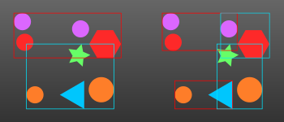
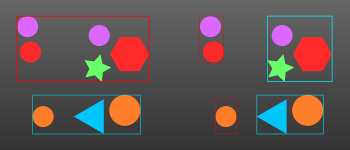

When rendering triangle meshes, calculating phaser hits, or finding out if the character falls on the ground,
we have to shoot many different rays and see if they hit anything. We can easily react thousands of rays to 
render a single frame of our real-time application. To get acceptable frame-rates, we have to make raycasting
rather efficient.

Here, algorithms and data structures come to our rescue. We form data structures called the acceleration data
structures for the current state of the frame, and use this for the rendering or other raycasting operations.
These structures are usually specialised tree data structures, and we run binary search over them. They bring
the closest-object operation from linear time to logarithmic time.

# Bounding Volume Hierarchy

A bounding volume hierarchy (BVH) is a tree data structure where each leaf node contains a scene object or a set of
objects that we want to handle together. Other than that, each node contains a bounding volume description.
These can be cuboids, spheres etc. something that is easy to find ray intersections with.

## Generation

The recursion happens until we reach the desired number of objects inside a leaf or we reach a certain number
of levels. Each step sorts the objects according to their coordinates, splits the sorted list into two, assigns
their bounding volumes, and keeps building each subtree. During the split, if we split at a given object, the 
object goes to the lower partition. This is because we usually use integer division which will produce more even 
partitions if we add the middle item to the lower partition instead of the upper. 0-based indices are assumed.

The bounding volume assignment has to make sure that all objects within the partition are enclosed completely 
by the volume. It is better to optimise to have minimally sized volumes, but we don't have to; it could be hard 
to do with spherical bounding volumes, for example.

## Traversal

Each step intersects the ray with the both bounding volumes under the current node, then keeps traversing the 
closer volume. If no hit happens, it has to traverse the farther volume also. When we reach the leaves we 
try to intersect with each object in the leaf; if no hit happens we return a null distance to report no hit. 

If a hit happens within the closer volume, the step also traverses the farther volume if its bounding volume 
distance is closer than the reported intersection distance of the closer node. This happens a lot if our chosen
splitting method (read below) have produced a hierarchy with a lot of intersecting bounding volumes.

## Splitting Methods

The best node splitting method depends on how the scene is laid out. The key thing we want to achieve is the
bounding volumes being spread as apart as possible at each level, so we have as much no-hit space as possible
when raycasting, allowing us to stop traversing at upper levels in this case. One method can in general be 
better than the other but you can choose whichever is more performant in your specific application.

For the demonstrations, the first level of the bounding volumes is shown on the left hand side and the second 
level of the bounding volumes on the right-hand-side. *There would also be the root bounding volume which would
enclose all objects but is omitted.*

**Median Object**

If we split at the median triangle, we will get the most balanced tree. The tree height will be log(n) where n
is the number of objects.

**Midpoint**

If we split at the geometric midpoint, we get a tree where regions with more triangles get themselves a taller 
subtree. This will make situations where one object covers a lot of triangles from the ray's point of view
much faster to compute intersection for.

As seen here, a midpoint split can yield unbalanced but much more spread-apart bounding volumes. If the rays
just pass in between the topmost bounding volumes we don't need to waste as much computation time in this case.

## Optimisation

First, the BVH can be reused for any raycasting as long as any object doesn't change in between.

The generation can be implemented similarly to an in-place merge sort, so we should use data structures that 
will make it indeed in-place. For traversal there isn't much to do.

One thing to note is that the splitting method I have described above creates nodes that are allocated in a
depth-first manner. You can also allocate the nodes then traverse to get pairs of bounding volumes next to each
other in memory. This is assuming you are allocating memory from athe lower to a higher address, e. g. by
appending to a list.

# Objects outside of the Acceleration Data Structure

We always have the method of linear iteration in our hands, so we can use this whenever an object we want to 
intersect is not in the acceleration data structure. If we have moving characters in a scene for an FPS game,
for example, we can first render the scene, also store its depth buffer, then blit the character renders onto
the background according to the background and character depth buffers. If we really need to test ray 
intersection on the backgrounds and the character, we treat the background BVH as a single object, intersect 
both the character and the background, and report the closest hit result among these tests.

Rigged meshes are very hard to generate acceleration data structures for. If the deformation happens before the
data is sent to the GPU, then the BVH can be generated each frame, including the character mesh triangles. This
seems like [how Epic Games' Unreal Engine Version 5 seems to work.](https://docs.unrealengine.com/5.0/en-US/ray-tracing-performance-guide-in-unreal-engine/#toplevelaccelerationstructurebuild)