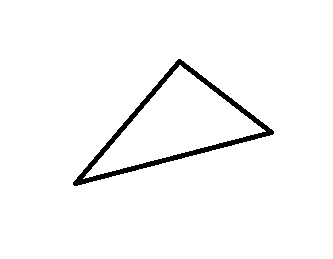

<script>
    import HiddenSurfaceRemovalApplet from "./_hidden-surface-removal/HiddenSurfaceRemovalApplet.svelte";
</script>

Hidden surface removal is one of the most fundamental problems to solve before rendering almost any 3D scene.



## Hiding Based on Turning Direction of Projected Triangles

3D objects in contemporary applications are usually composed of 3D triangles whose edges are coinciding with
each other to produce a closed form. In simple triangle-rasterising rendering, these triangles are first
projected onto the camera frustum's near plane using perspective or orthographic projection. When this is done,
the vertices either appear in clockwise or anticlockwise order. Usually if the triangle appears clockwise, we
say we are seeing the front side of it and render.

Which side we are on can easily be figured out by taking the cross product of two edges.

```glsl
#extension GL_OES_standard_derivatives : enable

precision highp float;

//GLSL Sandbox Uniform
uniform vec2 resolution;

//Clockwise order has to be a, b, c. a, b, c have already been projected.
bool isFront(vec4 a, vec4 b, vec4 c) {
	vec3 atob = (b - a).xyz;
	vec3 atoc = (c - a).xyz;
	atob.z = 0.0;
	atoc.z = 0.0;

	return cross(atoc, atob).z > 0.0;
}

void main( void ) {
	vec4 position = vec4(0.0);
		
	position.xy = gl_FragCoord.xy / resolution.xy;

	//if the triangle formed by (0, 0), (1, 1), and the screen point faces front
	if (isFront(vec4(0.0), vec4(1.0), position)) {
		gl_FragColor =  vec4(1.0, 1.0, 1.0, 1.0);
	}
	else {
		gl_FragColor =  vec4(0.0, 0.0, 0.0, 1.0);
	}
}
```

In the following applet, the blue vector is atoc and the red vector is atob. You can follow the direction of the right arrow to determine if the triangle is clockwise or anticlockwise.

<HiddenSurfaceRemovalApplet />

## Managing Overlapping Parts

This works great to correctly hide the necessary faces of convex shapes like spheres or cubes, but struggles for shapes which have complex shapes whose parts may overlap each other when projected at certain orientations.

For each overlapping part of the image, we find which object is closest to the camera. This can be done by

- ray tracing
- painter's algorithm
- z-buffering

In ray tracing, a ray is generated from the camera that contains all 3D points that would be projected to the solved pixel. Then this ray is
traced in miniscule steps and the pixel color is determined according to which object is hit first. The ray may be reflected, branched etc.
to simulate light even more realistically, which would bring us to physics-based rendering.

But what if we want to be fast? We can be fast by handling each triangle instead of each pixel on the screen. The first way is to sort triangles
based on the distance of their centroids to the camera, then rendering them from farthest to closest. This is called painter's algorithm, referring
to painters painting their paintings starting from the sky, then the background objects, and finally the closest subjects.

This is usually not done in OpenGL, so I am providing JS code which does the thing.

```js
let triangles = [
  [{x: 0, y: 0, z: 0}, {x: 2, y: 3, z: 5}, {x: 8, y: 9, z: 10}],
  [{x: 0, y: 0, z: 0}, {x: 2, y: 3, z: 5}, {x: 8, y: 9, z: 10}],
  [{x: 0, y: 0, z: 0}, {x: 2, y: 3, z: 5}, {x: 8, y: 9, z: 10}],
  //...
];

function project(p) {
  //project onto the z-plane
  return [p.x, p.y];
}

function triangleComparer(a, b) {
  return (a[0].z + a[1].z + a[2].z) - (b[0].z + b[1].z + b[2].z);
}

//remove back-facing triangles
triangles = triangles.filter(tri => isFront(project(tri[0]), project(tri[1]), project(tri[2])));

//sort based on centroid z
triangles.sort(triangleComparer);

//rasterize needs to be implemented
for (let triangle : triangles) rasterize(triangle);
```

The other way is to rasterising triangles the order they appear, but also onto a depth buffer of the render. After efficiently finding the depth value of each pixel of the triangle, we compose each pixel onto the final image if the depth of the pixel is closer to the camera than anything before.

OpenGL pretty much does the depth-buffering for us, so no example code will be given here. It can be fraud at best.