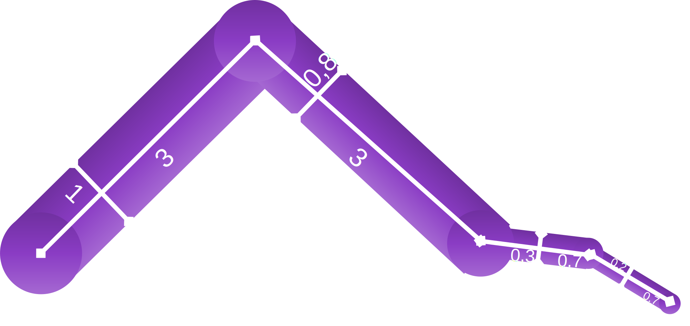
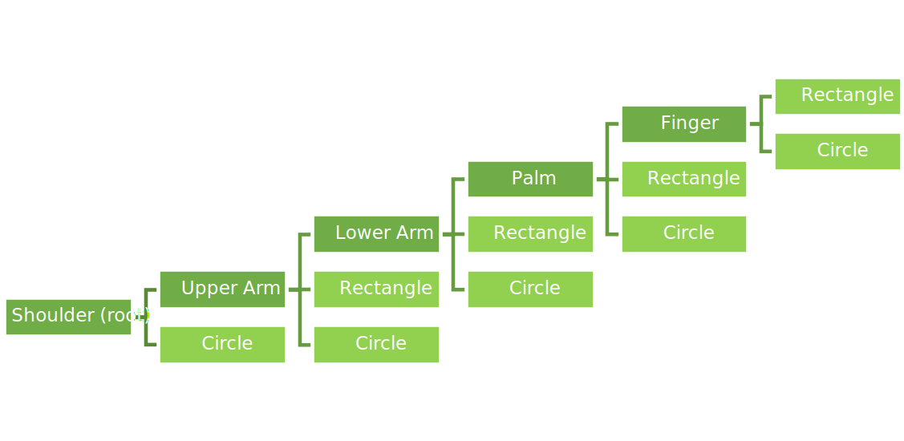

When we start talking about relative positions of different objects in 2D/3D space, we see that they form a hierarchy where the children are related to their parent by the fact that their independent transformation is given relative to their parent.

We can think of this hierarchy as a tree structure. The root of the tree would be the world. The camera and all the other objects would be descendants of world. Additionally we could parent camera to the player object, the arm of the player to the player’s torso etc.

The edges of this tree would store a transformation from the child’s _local space_ to the parent’s _local space_, or vice versa. You just have to know what you are doing. For this article we will store the transformation from the local space to the parent - so we have to multiply the local space matrices from the RHS.

By convention and since it makes applying parent-child relationships easy, we usually run a depth-first traversal over such hierarchy to calculate how objects local parts transform from the object’s local space to the _world space_ - the local space of the root of our tree.

What data structure do you use for a depth-first traversal? A stack, of course!

```
matrixStack = []
currentTransformation = indentityMatrix()

// Note that we have the call stack also

def traverse(tree) {
matrixStack.push(currentTransformation)
drawCurrent(currentTransformation)
for (child in tree.children) traverse(child)
currentTransformation = matrixStack.pop()
}

traverse(root)
```

This might seem like too much boilerplate, but you don’t need to explicitly write it and it ensures a few things:
 - The children can freely use any transformation.
 - When writing the algorithm, you don’t have to worry about breaking the current transformation when you make draw calls for children.
To give a possibly even more relatable analogy, the premises are pretty similar to x86 call conventions.

## Applying to a Real World situation

Let’s see how we can apply this to a scene that might occur in a Real World&trade; game/application. We are going to look at how to draw some blocky video game character’s arm.



The arm consists of four segments: upper and lower arm, palm, and finger. This way our character can hold things. We also can draw only two types of primitives: a rectangle that spans from (0, 0) to (2, 1) in the local space and a circle at the local origin with radius 1. We have to draw different sized rectangles for arm segments and circles to hide the tearing joints under rotation and the square tips of terminating segments.

We can first try to draw the scene hierarchy tree. We won't include the camera because it is beyond our scope right now.


Now, since we can’t go and draw an upper arm, we have to parent the necessary primitives to different objects, which will also have their own local transformations to bring them to the shape we want. 



Exploring what would happen if we didn’t add a layer of abstraction like this and added especially the scaling directly to the main objects is an exercise for the reader.

Then we can look at how the depth first traversal would happen. There is a straight path from the shoulder to the finger so we can say that would be the main traversal.

```
draw arm (matrix) {
current = matrix

draw shoulder(current)

push current
rotate current by upper arm angle
draw upper arm(current)
translate current by upper arm length

push current
rotate current by lower arm angle
draw lower arm(current)
translate current by lower arm length

push current
rotate current by palm angle
draw palm
translate current by palm length

push current
rotate current by finger angle
draw finger

pop current
pop current
pop current
pop current
}
```

Since this was a linear traversal, we didn’t need to push and pop any matrix at this level. Anyways, we will remove these calls next time we use it.

Now, we can look at how to draw segments. If you have noticed, we only have one type of segment which is made up of a rectangle and a circle, and which is distinguished by its thickness and length. We can write a function which will draw this.

```
draw segment (matrix, thickness, length) {
//remember, the rectangle primitive extends between (0, 0) and (2, 1)
localScaling = S(length / 2, thickness)
localTranslation = T(0, -0.5)
//we include the parent transformation here
loadMatrix(matrix * localScaling * localTranslation)
drawRectangle()

localScaling = S(thickness / 2)
localTranslation = T(length, 0)
loadMatrix(matrix * localTranslation * localScaling)
drawCircle()
}
```

Then you can replace the draw upper arm() etc. with a call to this function with proper arguments. How this is related to all the depth-first traversal is, if we receive the matrix argument by value, we can’t change its value as it appears in the caller. This provides the encapsulation of the transformations that we want for the children.

The final pseudocode for draw arm would look like

```
draw arm (matrix) {
current = matrix

draw circle(current)

current = current * R(upper arm angle)
draw segment(current, 1, 3)
current = current * T(3, 0)

current = current * R(lower arm angle)
draw segment(current, 0.8, 3)
current = current * T(3, 0)

current = current * R(palm angle)
draw segment(current, 0.3, 0.7)
current = current * T(0.7, 0)

current = current * R(finger angle)
draw segment(current, 0.2, 0.7)
}
```

<style>
    :global(code[class*="language-undefined"]) { color: white; }
</style>