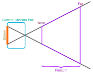

In my article about linear and affine transformations ı have talked about how CG people were so clever that they added a (n + 1)th dimension to their position vectors to enable translation. Well, this is still correct, but there is something more this is used for.

If you have looked into perspective before, you know that it makes farther objects shrink when they are perspective projected. This is achieved by dividing each point on the surface by its depth, something foreign to the linear transformations employed in 3D graphics, where every component of vectors are independently transformed.

To be able to do the necessary things using this linear framework, mathematicians have decided to use projective spaces. A projective space is a space of (n - 1) dimensions (a plane in the case of 3D) where a set of n-dimensional points will be mapped onto the same point. This might seem similar to orthographic projection, where you transform the scene into the camera local space and then drop the depth dimension. This article will focus onto the type where points that are multiples of each other map onto the same point.

For the projective space used for perspective, the rule is

```math
P(a\textup{\textbf{v}}) = P(b\textup{\textbf{v}})
```

where P is the projection function, v is an n + 1 dimensional vector and a and b are scalars. v is the representative of the set of vectors that are mapped the same. In OpenGL and usually in other CG frameworks, the representative has the extra component (we will call it w) as 1. This means we divide the transformed vectors by their extra component to get their representative. We can call the representative point the projected point.


We can adjust how the projection works by changing the extra component row of our projection matrix.


Linear transformation:
```math
\begin{pmatrix}
a&b&c&d\\
e&f&g&h\\
i&j&k&l\\
0&0&0&1\\
\end{pmatrix}
```

Vanishing point at the center of projective plane:
```math
\begin{pmatrix}
a&b&c&d\\
e&f&g&h\\
i&j&k&l\\
0&0&y&z\\
\end{pmatrix}
```

Vanishing point somewhere else:
```math
\begin{pmatrix}
a&b&c&d\\
e&f&g&h\\
i&j&k&l\\
w&x&y&z\\
\end{pmatrix}
```

Any useful perspective projection matrix create two singularities:
- all points far away from the origin seem to merge at the vanishing point.
- lines formed by all points projected onto the same representative point seem to emerge out of some focal point.

This corresponds to how pinhole cameras (*camera obscura* boxes) work. The focus is the pinhole and all light on the same line away from the focus shine onto the same point on the screen behind the pinhole. We can derive a projection matrix which will execute this appropriately.


To have a good reference frame while designing our scene and math, we talk about the thing called a frustum. Frustum is defined as a pyramid whose apex is cut off, revealing another face that is parallel to the base. In our case, the pyramid would have its apex at the focal point (or the pinhole) and the base would extend to infinity, forming the view cone. Note that we are exploiting the fact that we only have rays that pass through the pinhole unlike the real-world, so we can as well put the light capturing surface in front of the pinhole to get a right-side-up image.



Frustum in 2D with the simulated camera obscura box.

The near plane is what we have told about above — the cut face of the frustum. The frustum will be mapped onto n normalized coordinates between -1 and 1. If we map the points on the near plane to depth coordinate 1, we map some to -1; the latter points will be on the far plane. Points on the other faces of the frustum will have -1 or 1 as other mapped coordinates. By the way, to get actual projection, we just drop the depth coordinate after finding the representative point.


To derive the projection matrix, let’s start with how w is calculated for a 3D point. Let’s say the near plane is at a distance n and the far plane is at a distance f to the focal point. We aim for the points on the near plane to keep their coordinates other than the depth the same, so we want w to be 1 for these points. We also want z’ (the mapped depth coordinate) to be 1 for the near plane and -1 for the far plane.


z’ = -1 for points on near
z’ = 1 for points on far
w = 1 for points on near and w is linearly proportional to the depth.


First, the equation for w is -z/n. The negative is because z is negative for points in front of the camera.


Let midpoint be (near + far)/2. z’ is (signed distance from midpoint)/(signed distance of far from midpoint)


The equation would be

```math
z’ = -\frac{z - \frac{n + f}{2}}{\frac{n - f}{2}}\\
\\
z’ = -\frac{2z}{n - f} + \frac{n + f}{n - f}
```

a nice linear function. But here is the catch: the pipeline will divide everything by w afterwards so we need to scale everything by w. We gotta read the z’ value before such division occurs.


Since we made sure nothing on the near plane will be perspective divided, the transformation for the coordinates other than depth can stay as identity.


Oh hey, we have got the OpenGL perspective projection matrix! Note that this is slightly different than the original and there is usually an aspect ratio involved on the ones you would find on the Internet. This matrix works comparedly fine.

```math
\begin{pmatrix}
1&0&0&0\\
0&1&0&0\\
0&0&-\frac{2}{n - f}&\frac{n - f}{n + f}\\
0&0&-1/n&0\\
\end{pmatrix}
```